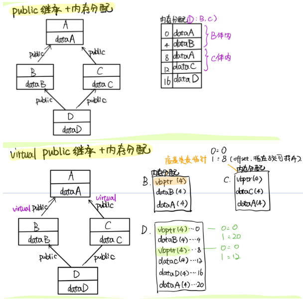
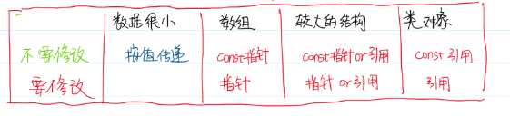

## C++背题大纲

[TOC]

### 0.c++内存分配方式

在C++中，内存分成5个区，他们分别是堆、栈、自由存储区、全局/静态存储区和常量存储区。
　　**栈**：在执行函数时，函数内局部变量的存储单元都可以在栈上创建，函数执行结束时这些存储单元自动被释放。栈内存分配运算内置于处理器的指令集中，效率很高，但是分配的内存容量有限。
　　**堆**：就是那些由 `new`分配的内存块，他们的释放编译器不去管，由我们的应用程序去控制，一般一个`new`就要对应一个 `delete`。如果程序员没有释放掉，那么在程序结束后，操作系统会自动回收。
　　**自由存储区**：就是那些由`malloc`等分配的内存块，他和堆是十分相似的，不过它是用`free`来结束自己的生命的。
　　**全局/静态存储区**：全局变量和静态变量被分配到同一块内存中，在以前的C语言中，全局变量又分为初始化的和未初始化的，在C++里面没有这个区分了，他们共同占用同一块内存区。程序结束后由系统统一释放。
　　**常量存储区**：这是一块比较特殊的存储区，他们里面存放的是常量，不允许修改。

​		**程序代码区**：存放已编译程序的机器代码。存放类的成员函数

### 1.虚函数

>定义一个函数为虚函数，不代表函数为不被实现的函数。
>定义他为虚函数是为了允许用基类的指针来调用子类的这个函数。
>定义一个函数为纯虚函数，才代表函数没有被实现。
>定义纯虚函数是为了实现一个接口，起到一个规范的作用，规范继承这个类的程序员必须实现这个函数。

1. **虚函数的作用**

   为了实现动态多态（运行时决定调用哪一个），与之相对的是静态多态（编译时决定，如函数重载、模板类的非虚函数调用）

2. **虚函数底层如何实现**

   通过维护虚函数表和VPTR指针来实现。即虚函数表+虚表指针

   编译器处理虚函数的方法是：为每个类对象添加一个隐藏成员，隐藏成员中保存了一个指向函数地址数组的指针，称为虚表指针（vptr），这种数组成为虚函数表（virtual function table, vtbl），即，**每个类使用一个虚函数表，每个类对象用一个虚表指针**。

3. **VPTR什么时候被初始化？**

   在构造函数的时候执行初始化。对象在创建时，由编译器对VPTR指针进行初始化；只有当对象的构造完全结束后VPTR的指向才最终决定下来。

   父类对象的VPTR指向父类的虚函数表，子类对象的VPTR指向子类的虚函数表。

   定义子类对象时，VPTR先指向父类的虚函数表，在父类构造完成之后，子类的VPTR才指向自己的虚函数表。（**两阶段**）（这也就是在父类或者子类的构造函数中调用虚成员函数不会实现多态的原因，这是一道面试题）

4. **虚函数+MI，派生类的VPTR怎么被初始化？怎么存放？**

   

5. **虚函数表放在哪里**

   放在全局数据区。c++程序所占用的内存一般分为：栈区,堆区,程序代码区（存放函数体的二进制代码）,全局数据区(静态区),文字常量区.

   

6. **构造函数不能是虚函数，为什么？**

   虚函数的指针要靠构造函数初始化。

   从存储空间角度，虚函数对应一个指向vtable虚函数表的指针，这大家都知道，可是这个指向vtable的指针其实是存储在对象的内存空间的。问题出来了，如果构造函数是虚的，就需要通过 vtable来调用，可是对象还没有实例化，也就是内存空间还没有，怎么找vtable呢？所以构造函数不能是虚函数。（**构造的时候还无所谓虚表指针的概念，使用上无法引用**）

   构造一个对象的时候，必须知道对象的实际类型，而虚函数行为是在运行期间确定实际类型的。而在构造一个对象时，由于对象还未构造成功。编译器无法知道对象的实际类型，是该类本身，还是该类的一个派生类，或是更深层次的派生类。无法确定。。。

7. **析构函数必须是虚函数，为什么？**

   举例 `base* p = new Derived()`，在析构的时候`delete p;`，如果析构函数不是虚函数，delete的时候结果是未定义的，通常来说是`Derived`的对象没有被销毁。相当于只销毁了`base`部分的内容，造成一个诡异的局部销毁的对象。

   但是无端将析构函数都设置为虚函数是不对的。如果class中没有其他virtual函数，这就说明当前这个class没意图被当作一个base class，这时候将其声明为virtual是不合适的，因为会增加这个类的存储开销。

   同时设计的类不能继承STL，因为STL中析构函数通常不是virtual的。*《Effective C++》条款07*

8. **析构函数可以抛出异常吗？为什么不可以？**

   如果析构函数需要调用delete，但是在执行delete之前就抛出异常中止了程序，会导致内存泄漏，进而引发更多异常。

   有几种做法：1.抛出异常就用`abort()`结束程序 ；2.吞下发生的异常，仅仅记录一下（通常不是个好办法）；  3. 重新设计接口，使得客户有机会对异常做出反应：将责任从析构函数上转移到用户手上（提供一个普通函数而非析构函数处理这个异常）*《Effective C++》条款08*

9. **可以在构造函数和析构函数中调用virtual函数吗？不可以**

   在构造和析构期间不要调用virtual函数，因为这类调用从来不会下降到`derive class`(比起当前执行构造函数和析构函数的那层来说)

   派生类对象构造期间进入基类的构造函数时，对象类型变成了基类类型，而不是派生类类型。同样，进入基类析构函数时，对象也是基类类型。这样并不会出现多态，所以没有必要调用虚函数*《Effective C++》条款09*

   

### 2.纯虚函数

含有纯虚函数的类不能实例化，就是一个抽象类

`virtual fun() = 0;`


### 3.内存泄漏 内存溢出 野指针

**内存泄漏**：new了没delete

**内存溢出**：程序在申请内存的时候没有足够的内存空间，原因可能有：

​	内存真的装满了；代码死循环；递归调用太深，堆栈溢出。

**野指针**：定义了个指针没有初始化，delete/free指针后没有置空，指向的对象生命周期已经过了

- 递归调用太深了会怎么样？怎么解决？

  会导致栈溢出：每调用一次方法，就会在栈上创建一个栈帧（方法结束后弹出栈帧）

  解决方法:

  ​	改成循环、用个变量记录递归次数、尾递归（调用多少次都只占一个栈帧）

- 内存泄漏怎么定位

  用什么方法检测？ 【CRT】

  怎么定位到具体哪一行代码发生了内存泄漏？【用CRT看看是第多少次操作泄漏的，然后再设个断点到那里停下。。（都是CRT的函数）】


### 4.访问控制

1. **class/struct里成员的默认访问控制**

   - 默认访问权限：struct作为数据结构的实现体，它默认的数据访问控制是public的，而class作为对象的实现体，它默认的成员变量访问控制是private的。

2. **成员的访问控制细节（private protected public 可不可以被 类的实例/类的友元访问）**

   类的实例：可以访问public

   类的友元：可以访问一切public protected private

   类的派生类：可以访问public protected

3. **class/struct继承链里的默认访问控制**

   - 默认的继承访问权。class默认的是private继承， struct默认的是public继承。
   - struct可以继承class，同样class也可以继承struct，那么默认的继承访问权限是看子类到底是用的struct还是class。子类是class默认就是private继承。

4. **继承链中的访问控制细节** https://www.cnblogs.com/qlwy/archive/2011/08/25/2153584.html

   - public继承，派生类的成员函数能看到什么，派生类的实例能看到什么

     基类的一切不变的加入到派生类

   - protected继承……

     private protected protected

   - private继承……

     private private private 	


### 5.类中对象分布

1. **一个空类sizeof**

   1。类的实例化就是给每一个实例在内存中分配一块地址。空类被实例化时，会由编译器隐含的添加一个字节。所以空类的size为1。

2. **一个类中有static对象的sizeof**

   1。静态数据成员被编译器放在程序的一个global data members中，它是类的一个数据成员，但不影响类的大小。不管这个类产生了多少个实例，还是派生了多少新的类，静态数据成员只有一个实例。

3. **一个空类继承了一个基类的sizeof**

   基类大小

4. **多重继承时的内存分配（多重继承还带virtual继承时的分配）**

   

5. **决定一个类有多大的因素（6条）**

   类的大小与构造函数，析构函数，普通成员函数无关。即普通成员函数，静态成员函数，静态数据成员，静态常量数据成员均对类的大小无影响

   虚函数对类的大小有影响，是因为虚函数表指针带来的影响

   虚继承对类的大小有影响，是因为虚基表指针带来的影响

   空类的大小是一个特殊情况,空类的大小为1


### 6.overload重载 override覆盖 overwrite重写的区别

1. **overload重载：**

   ```c++
   int func(int x)
   int func(int x, int y)
   ```

   如果写成：

   ```c++
   int func(int x)
   int func(int x, int y=0)  // 在调用func(1)的时候会报错，非唯一匹配
   ```

   如果写成

   ```c++
   double func()
   int func()
   ```

   会报错，返回值不能算在函数重载，重载只有参数

2. **override是覆盖**

   就是派生类里重写了基类virtual的部分（参数什么的都必须完全相同）。

   C++11里有关键字override（表示自己重写了）和final（声明基类函数不能再重写了）

   override的特例，如果有默认参数，就不会动态绑定了（默认参数的值会在编译时确定）

3. **overwrite是重写**

   就是派生类里重写了基类同名函数（除了override的部分）


### 7.空类自带六个函数，哪六个？

空类声明时不会生成任何从成员函数

空类定义时会生成6个成员函数：一个默认构造函数、一个拷贝构造函数、一个析构函数、一个赋值运算符、两个取址运算符（const版本和非const版本）

```c++
class Empty
{
  public:
    Empty();                            //缺省构造函数
    Empty(const Empty &rhs);            //拷贝构造函数
    ~Empty();                           //析构函数 
    Empty& operator=(const Empty &rhs); //赋值运算符
    Empty* operator&();                 //取址运算符
    const Empty* operator&() const;     //取址运算符(const版本)
};
```


### 8.static关键字

1. **局部static的作用**

   static局部变量在函数内定义的话，其生存周期为整个源程序。但是作用域还是不变的。（**保持局部变量持久性**）

2. **全局static的作用**

   加了static前缀的全局变量和函数会只在当前源文件中可见，对于其他源文件是不可见的。（**隐藏作用**）

   默认初始化为零。(其实存储在静态数据区的变量，所有字节默认值都为0x00)

3. **类中的static变量**

   - 存放在哪？（全局/静态存储区）
   - 怎么初始化？（类外初始化 `int A:sa = 5` 当然，如果在加上关键const, 则是可以在类中进行初始化的。）
   - 不能调用其他的非静态对象

4. **类中的static成员函数**

   - 有没有this指针？（无）

   - 能不能搞一个static virtual?

     不能。因为静态成员函数属于类，在内存中只有一份。而虚函数必须根据对象类型才能知道调用哪一个虚函数，故虚函数是一定要在对象的基础上才可以的，两者一个终归属于类，一个必依赖于对象，那么终归是不能合二为一的。

   - 既可以通过对象访问，也可以用A::f()访问（非static成员函数必须通过对象访问）

   - 静态成员函数（只能访问静态的数据/方法，和外部的函数）

   - 静态成员函数不能声明为const

     const 修饰成员函数表示 该成员函数不会修改某个该函数所属的对象(const修饰的成员方法必须有this指针)，static不属于任何对象,没有this指针。


### 9.const关键字

1. **变量+const**

   const int n 和 int const n等价，记得必须声明同时初始化。表示希望这种值不会改变

2. **const指针/指向const的指针**

   关键字const出现在 * 左边，表示被指物为常量；如果出现在 * 右边，表示指针自身是常量。

   ```c++
   const int* a; // 指向const的指针  指向的东西不能变
   int *const b; // const指针，指针本身的值是个const，相当于一直指向某个东西不可更改
   ```

3. **const引用/普通引用**

   ```c++
   int a = 5;
   const int b = 6;
   int &ra = b; // 普通引用，可读可写
   const int &rb = b; // const引用，只读，赋啥都行，反转都是只读
   ra++; //普通引用可写
   rb++; // const 引用不可写
   ```

4. **成员函数+const**（果然static的成员函数是不可以配const的 这相当于给this指针加const）

   在类型名前面加上const表述返回类型不可更改

   在参数列表之后加上const表示不会更改这个对象的变量。

   将const实施于成员函数的目的，是为了确认该成员函数可以作用域const对象身上。因为pass by reference-to-const可以提高c++程序的效率，因此有些时候对于同一个成员函数，我们需要提供const版本和非const版本。*《Effective C++》条款03*


### 10.inline关键字

1. **inline关键字有什么作用**

   如果一些函数被频繁调用，不断地有函数入栈，即**函数栈**，会造成栈空间或**栈内存**的大量消耗。为了解决这个问题，特别的引入了**inline修饰符**，表示为**内联函数**。inline函数的整体观念是，将“对此函数的每一个调用”都以函数本体替换之。

   一次函数调用其实包含一系列工作：调用前要先保存寄存器，并在返回时恢复；可能需要拷贝实参；程序转向一个新的位置继续执行。内联函数可以避免函数调用的开销。将函数指定为内联函数，通常就是将它在每个调用点上“内联的展开”。

   但是inline会带来代码膨胀，尤其对template作者来说。

2. **函数体内有什么情况下，编译器会拒绝给他置成inline（3种）**

   - 如果函数体内的代码比较长，使用内联将导致内存消耗代价较高。
   - 如果函数体内出现循环，那么执行函数体内代码的时间要比函数调用的开销大。
   - 函数体内有递归、虚调用等

3. **define 和 inline 的区别**

   define是定义预编译时处理的宏，就是简单的字符串替换，没有类型检查。

   inline是用来定义一个类的内联函数，是编译阶段完成的。内联函数要做类型安全检查，就是将代码嵌入进去，对于短函数来说能够提升性能。

   而其实内联函数只是对于编译器的建议，大部分时候还是交由编译器解决。


### 11.析构函数私有化的作用

析构函数私有化：把析构函数定义为私有成员可以保证只能在堆上new一个新的类对象。用new生成的对象保存在堆上，可以自由控制生命周期。

原因是C++是一个静态绑定的语言。在编译过程中，所有的非虚函数调用都必须分析完成，即使是虚函数，也需检查可访问性。当在栈上生成对象时，对象会自动析构，也就说析构函数必须可以访问。而堆上生成对象，由于析构时机由程序员控制，所以不一定需要析构函数。当然外部调用delete自然也无法通过编译，销毁对象对象的方式是在某个方法或友元内部调用delete this。这么做的目的通常是不希望用户控制对象生存周期。


### 12.STL


### 13.C++11智能指针

1. **智能指针 shared_ptr auto_ptr 熟悉原理，可以手撕**

   shared_ptr的实现基于引用计数技术。智能指针管理的着一个对象，并记录着所有管理同个对象的指针个数，这个个数称为计数。藉由智能指针去初始化或赋值其他智能指针时，计数的值增加1，表示资源对象多了一个引用；当智能指针的生命周期结束或者指向别的对象时，计数的值减去1，表示资源对象减少一个引用。智能指针生命周期结束时，编译器会调用它的析构函数，在析构函数中判断引用计数的值是否为0，若为0，则释放所管理的对象资源；若不为0，表明还有其他指针指向所管理的对象，不释放该对象资源。

   auto_ptr是独占形的智能指针，在同一个时刻中，只能有一个auto_ptr指向一个给定的对象，但是这会导致auto_ptr进行不正常的复制、赋值行为：

   ```c++
   auto_ptr<int> p1(new int(1));  /*1*/
   auto_ptr<int> p2(p1); /*2*/
   auto_ptr<int> p3; 
   p3= p2;/*3*/
   // p1 开始管理着值为1的对象，执行了2之后，p1被置空，由p2独占对象资源；执行3之后，p2被置为空，由p3独占对象资源
   ```

   并且STL容器容不得auto_ptr（会造成对无效指针的访问从而导致程序崩溃），因此弃用了，转而使用unique_ptr（拒绝直接的复制/赋值操作，需通过reset/release接口进行对象管理权的转移，这提高了安全性）

   实现：https://blog.csdn.net/worldwindjp/article/details/18843087

2. **智能指针可能出现的问题？**

   - 循环引用

     因为 Shared_ptr 是多个指向的指针，可能出现循环引用，导致超出了作用域后仍有内存未能释放。

   - 基于引用计数的一些性能损耗

3. **要熟悉管理权转让的坑（int *和智能指针管理权转让经常崩溃）**

4. **unique_ptr和weak_ptr是什么**

   std::unique_ptr 是通过指针占有并管理另一对象，并在 unique_ptr 离开作用域时释放该对象的智能指针。在下列两者之一发生时用关联的删除器释放对象：

   - 销毁了管理的 unique_ptr 对象
   - 通过 operator= 或 reset() 赋值另一指针给管理的 unique_ptr 对象。

   

   std::weak_ptr 是一种智能指针，它对被 std::shared_ptr 管理的对象存在非拥有性（“弱”）引用。在访问所引用的对象前必须先转换为 std::shared_ptr。

   weak_ptr是一种不控制所指向对象生命期的智能指针，它指向由一个shared_ptr管理的对象。讲一个weak_ptr绑定到一个shared_ptr不会改变shared_ptr的引用计数，一旦最后一个指向对象的shared_ptr被销毁，对象就会被释放，即使有weak_ptr指向对象，对象还是会被释放。weak_ptr也取名自这种弱共享对象的特点。

   相对于weak_ptr来说 ，shared_ptr是一种强引用的关系。在循环引用的情况下资源得不到回收，将造成内存泄漏。如下图出现了引用计数的循环引用问题：对象A被对象B所引用，对象C被对象A所引用，对象B被对象C所引用，这时每个对象的引用计数都是1，都在等待在引用它的对象释放对象，造成一种循环等待的现象，而资源也不会被如愿释放掉。

   

   weak_ptr弱引用的出现正是能够打破这种循环引用。由于弱引用不更改引用计数，类似普通指针，只要把循环引用的一方使用弱引用，即可解除循环引用。虽然通过弱引用指针可以有效的解除循环引用，但这种方式必须在程序员能预见会出现循环引用的情况下才能使用，也可以是说这个仅仅是一种编译期的解决方案，如果程序在运行过程中出现了循环引用，还是会造成内存泄漏的。因此，即使使用了智能指针，C++还是无法完全杜绝内存泄漏的问题。

5. **智能指针陷阱与使用建议**

   - 尽量用make_shared/make_unique，少用new

     >`std::shared_ptr`在实现的时候使用的refcount技术，因此内部会有一个计数器（控制块，用来管理数据）和一个指针，指向数据。因此在执行`std::shared_ptr<A> p2(new A)` 的时候，首先会申请数据的内存，然后申请内控制块，因此是两次内存申请，而`std::make_shared<A>()`则是只执行一次内存申请，将数据和控制块的申请放到一起。

   - 不要使用相同的内置指针来初始化(或者reset)多个智能指针

   - 不要delete get()返回的指针

   - 不要用get()初始化/reset另一个智能指针

   - 智能指针管理的资源它只会默认删除new分配的内存,如果不是new分配的则要传递给其一个删除器

   - 不要把this指针交给智能指针管理

     ```c++
     class Test{
     public:
         void Do(){  m_sp =  shared_ptr<Test>(this);  }
     private:
         shared_ptr<Test> m_sp;
     };
     int main()
     {
         Test* t = new Test;
         shared_ptr<Test> p(t);
         p->Do();
         return 0;
     }
     // 以下代码发生了什么事情呢？还是同样的错误。把原生指针 this 同时交付给了 m_sp 和 p 管理，这样会导致 this 指针被 delete 两次。
     // 这里值得注意的是：以上所说的交付给m_sp 和 p 管理不对，并不是指不能多个shared_ptr同时占有同一类资源。shared_ptr之间的资源共享是通过shared_ptr智能指针拷贝、赋值实现的，因为这样可以引起计数器的更新；而如果直接通过原生指针来初始化，就会导致m_sp和p都根本不知道对方的存在，然而却两者都管理同一块地方。相当于”一间庙里请了两尊神”。
     ```

   - 不要把一个原生指针给多个shared_ptr或者unique_ptr管理

     ```c++
     int* ptr = new int;
     shared_ptr<int> p1(ptr);
     shared_ptr<int> p2(ptr);
     // p1,p2析构的时候都会释放ptr，同一内存被释放多次！
     // 我们知道，在使用原生指针对智能指针初始化的时候，智能指针对象都视原生指针为自己管理的资源。换句话意思就说：初始化多个智能指针之后，这些智能指针都担负起释放内存的作用。那么就会导致该原生指针会被释放多次！！
     ```


### 14.左值右值/移动语义 lambda表达式

1. **左值右值**

   左值指的是既能够出现在等号左边也能出现在等号右边的变量(或表达式)，右值指的则是只能出现在等号右边的变量(或表达式).

   *左值 (lvalue, locator value)* 表示了一个占据内存中某个可识别的位置（也就是一个地址）的对象。

   *右值 (rvalue)* 则使用排除法来定义。一个表达式不是 *左值* 就是 *右值* 。 那么，右值是一个 *不* 表示内存中某个可识别位置的对象的表达式。

2. **移动语义**

   如果使用拷贝赋值操作符，考虑`v2 = Intvec(33);`，在具体构造的时候会需要如下步骤：

   ```
   constructor
   copy assignment operator
   copy constructor
   destructor
   destructor
   ```

   即会创建一个零食对象用来执行拷贝构造。

   c++11的右值引用(只能绑定到一个即将被销毁的对象，用&&表示)，让我们可以实现“移动语义” (move semantics)，特别是可以实现“移动赋值操作符” (move assignment operator)，就不需要一个临时对象了。步骤如下：

   ```
   constructor
   move assignment operator
   destructor
   ```

   新的标准认为：移动构造函数和移动拷贝函数应对左值和右值有不同的处理，而**std::move**就是其统一的解决手段。**std::move**可以将一个左值转化为右值引用以实现移动拷贝

3. **lambda表达式**

   定义了一个匿名函数，并且可以捕获一定范围内的变量

   *[capture]\(params\)mutable->return-type{statement}*

   \[capture\]：捕获列表， 捕获上下文变量供lambda使用，同时[]是指示符，指示为lambda函数。

   (params)：参数列表，和普通函数一致。

   mutable：修饰符，通常lambda函数是const函数，mutable可以取消常量性，使用的时候参数列表不能忽略

   ->return-type：返回值类型

   {statement}：函数体，可以使用参数和被捕获的变量

   一般来说，lambda用[]开头，这也是我们辨识它的一个办法。

   **例子**：在使用STL的sort()算法的时候，通常需要指定一个比较的函数，用函数指针（仿函数？）传递，但是现在我们可以用

   [\](int a, int b) -> bool {return a < b;}

   来作为传入的函数，这样就比较明了了。

   方括号名为捕获，其实就是指明函数内部可以访问的外部变量，同时因为lambda表达式是const函数，所以不用担心对外界的变量修改。


### 15.指针和引用的区别

1. **区别**

   引用必须边声明边初始化（没有赋值一说）

2. **什么时候用引用，什么时候用指针**

   引用的作用：程序员可以修改数据；传引用可以提高程序的运行速度

   


### 16.堆和栈的区别

1. 管理方式不同。栈由操作系统自动分配释放，无需我们手动控制；堆的申请和释放工作由程序员控制，容易产生内存泄漏；
2. 空间大小不同。每个进程拥有的栈的大小要远远小于堆的大小。理论上，程序员可申请的堆大小为虚拟内存的大小
3. 生长方向不同。堆的生长方向向上，内存地址由低到高；栈的生长方向向下，内存地址由高到低。
4. 分配方式不同。堆都是动态分配的，没有静态分配的堆。栈有2种分配方式：静态分配和动态分配。静态分配是由操作系统完成的，比如局部变量的分配。动态分配由alloca函数进行分配，但是栈的动态分配和堆是不同的，他的动态分配是由操作系统进行释放，无需我们手工实现。
5. 分配效率不同。栈由操作系统自动分配，会在硬件层级对栈提供支持：分配专门的寄存器存放栈的地址，压栈出栈都有专门的指令执行，这就决定了栈的效率比较高。堆则是由C/C++提供的库函数或运算符来完成申请与管理，实现机制较为复杂，频繁的内存申请容易产生内存碎片。显然，堆的效率比栈要低得多。

线程自己有一套堆栈，但是其他都是公用的。
**问：sizeof实现原理？sizeof的结果是在哪个阶段确定的？**

答：编译时就决定的，编译器计算完括号里的值，返回一个字节数。他不是函数，是个关键字。那个值也不是在传参。。

**问：让你实现sizeof的话怎么实现呢**

答：return (unsigned int)(&x+1)-(unsigned int)(&x)


### 17.C++11有多少种构造函数

默认构造函数：Student()

初始化构造函数：Student(int  num, int age)

拷贝构造函数：Student(Student&)

移动构造函数：Student(Student&&)

委托构造函数: Student(int i) : Student(i, i)   将构造委托给上文的初始化构造函数


### 18.C++内存对齐

假如没有内存对齐机制，数据可以任意存放，现在一个int变量存放在从地址1开始的联系四个字节地址中，该处理器去取数据时，要先从0地址开始读取第一个4字节块,剔除不想要的字节（0地址）,然后从地址4开始读取下一个4字节块,同样剔除不要的数据（5，6，7地址）,最后留下的两块数据合并放入寄存器.这需要做很多工作.


现在有了内存对齐的，int类型数据只能存放在按照对齐规则的内存中，比如说0地址开始的内存。那么现在该处理器在取数据时一次性就能将数据读出来了，而且不需要做额外的操作，提高了效率。


### 19.四种cast

1. **static_cast**

   - 当需要把一个较大算数类型赋值给较小的类型时，**static_cast**非常有用

     ```c++
     double slope = static_cast<double>(j) / i;
     ```

   - 将指针从void*转换回原来的类型

     ```c++
     void* p = &d;
     double *dp = static_cast<double*>(p);
     ```

   - 作类间基类子类指针引用的转换，但没有保证安全性；子转基类是安全的但是基类转子类没有动态类型检查不安全

2. **const_cast**

   1. 只有**const_cast**可以改变表达式的常量属性
   2. 不能用**const_cast**改变表达式的类型

3. **dynamic_cast**

   1. 用于将基类的指针或引用安全地转换成派生类的指针或引用

      ```c++
      dynamic_cast<type*>(e) // 若失败返回0
      dynamic_cast<type&>(e) // 若失败 抛出异常
      dynamic_cast<type&&>(e)
      ```

      dynamic_cast<type_id> (expression)  type_id和expression必须是同一种类型。转向的类型(type_id)必须是类指针、引用或者void*。

      dynamic_cast运算符可以在执行期决定真正的类型。如果downcast是安全的（也就说，如果基类指针或者引用确实指向一个派生类对象）这个运算符会传回适当转型过的指针。如果downcast不安全，这个运算符会传回空指针（也就是说，基类指针或者引用没有指向一个派生类对象）。


      dynamic_cast主要用于类层次间的上行转换和下行转换，还可以用于类之间的交叉转换。


      在类层次间进行上行转换时，dynamic_cast和static_cast的效果是一样的；


      在进行下行转换时，dynamic_cast具有类型检查的功能，比static_cast更安全。

4. **reinterpre_cast**

   可以指针和整数之间互相转换，先把指针转整数，再把该整数转回那个类型指针可以还原指针值。

   可以理解为重新解释的意思。

   ```c++
   reinterpret_cast<type_id> (expression)
   nt i; 
   char ch='A';
   i=reinterpret_cast<int>(ch); // i=65
   ```

   该运算符把expression重新解释成type-id类型的对象。对象在这里的范围包括变量以及实现类的对象。

   此标识符的意思即为数据的二进制形式重新解释，但是不改变其值。


### 20.override与final


### 21.数据量超过内存读取上限的情况怎么处理


### 22.new与malloc

1. new在申请空间的时候会调用构造函数，malloc不会
2. new在申请空间失败后返回的是错误码bad_alloc，malloc在申请空间失败后会返回NULL
3. new在申请内存分配时不需要指定内存块大小，编译器会更具类型计算出大小，malloc需要显示的指定所需内存的大小
4. new操作符申请内存成功时，返回的是对象类型的指针，类型严格与对象匹配，无需进行类型转换，因此new是类型安全性操作符。malloc申请内存成功则返回void*，需要强制类型转换为我们所需的类型
5. 对于自定义类型：new会先调operator new函数，申请足够的内存（底层也是malloc实现），然后调用类的构造函数，初始化成员变量，最后返回自定义类型指针。delete先调用析构函数，然后调用operator delete函数来释放内存（底层是通过free实现）。malloc/free是库函数，只能动态的申请和释放内存，无法强制要求其做自定义类型对象构造和析构函数
6. C++允许重载new/delete操作符，特别的，布局new的就不需要为对象分配内存，而是指定了一个地址作为内存起始区域，new在这段内存上为对象调用构造函数完成初始化工作，并返回地址。malloc不允许重载。


